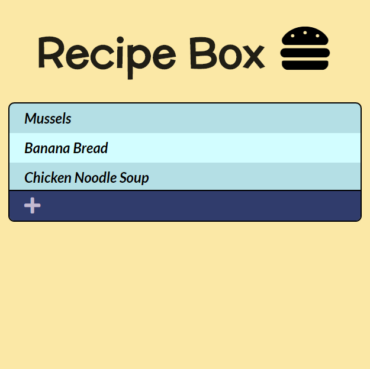

<i>See project live at <a href="http://thane-engen.com/recipe-box">www.thane-engen.com/recipe-box</a></i>

***

# Recipe Box

A list of recipes that you can view, add to, edit, or delete. 
REST API is written completely on the front end with the help of JSON-Server.

Technologies used:

* HTML5
* CSS3, Bootstrap
* Javascript (ES6), ReactJS, React Portals
* Redux, Redux Thunk, Redux Form
* JSON-Server (for data storage and miming API request methods)
* Axios
* Npm, Git

***

## Summary

&nbsp;&nbsp;&nbsp;&nbsp;&nbsp;&nbsp;This project was one that I spent a lot of time tailoring to try and perfect. There were multiple occasions in which I felt completely lost but after dozens of hours of work, I think that it works great!

&nbsp;&nbsp;&nbsp;&nbsp;&nbsp;&nbsp;This was my first project using Redux. Although Redux is an excellent tool to handle actions and manage state, for smaller applications, such as this one, it can seem like overkill when everything that can be accomplished with Redux can also be accomplished with React with potentially less code. However, Redux is an incredibly valuable tool to know, and for this reason, I committed myself to learning the fundamentals of this technology.

&nbsp;&nbsp;&nbsp;&nbsp;&nbsp;&nbsp;My motivation for using Redux was not only to learn the basics of this technology, but it also became useful when handling REST API calls. The majority of my 'Redux store' revolves around framing these API requests with Axios. It was difficult to make sure that these API calls functioned correctly, as I was not only using JSON-Server to seed data to my project, but I also had to import and configure Redux Thunk correctly, because this package allows developers to write asynchronous actions, while a 'Redux store' normally doesn't provide this functionality. A 'Redux Store' that primarily revolves around saving API functions absolutely needs to take asynchronous actions into account, and for that reason, 'Redux Thunk' became an absolute necessity in my project.

&nbsp;&nbsp;&nbsp;&nbsp;&nbsp;&nbsp;I also used a React portal to create a modal. This modal functions as my form, and thus the part of my project in which my 'create' and 'edit' API routes live. I enjoyed this aspect of the project because I discovered that React portals are fairly staightforward, and I could see them being useful for many occasions.

&nbsp;&nbsp;&nbsp;&nbsp;&nbsp;&nbsp;However, what was difficult about using a React portal, was not the portal itself, but my incorporation of Redux Form to handle user submissions. Because a lot of my data was simply separate listings of repetitive 'ingredients' or 'directions' (it is an application that saves recipes after all), my data was very array based. Any assumption that using Redux Form would be simple, especially with arrays and the inevitable use of list mapping, was thrown out the window immediately. Redux Form does have documentation for array-based forms, but it is surpisingly very complicated. After literally days of struggling to figure this out, I managed to get my form to work properly and it was probably the most rewarding achievement of the entire project. 

&nbsp;&nbsp;&nbsp;&nbsp;&nbsp;&nbsp;One really great thing about Redux Form is that it makes form verification really straightforward. Although Redux Form can, at times, feel like a complicated mess, form verification is truly a lot easier than normal when going down this route.

&nbsp;&nbsp;&nbsp;&nbsp;&nbsp;&nbsp;That about sums it up. I did have other occasional issues with lifecycle methods and Bootstrap styling, but nothing that I feel is too important to add. Overall, I'm very proud of this project and what I managed to accomplish! 

***

## Author

Thane Engen